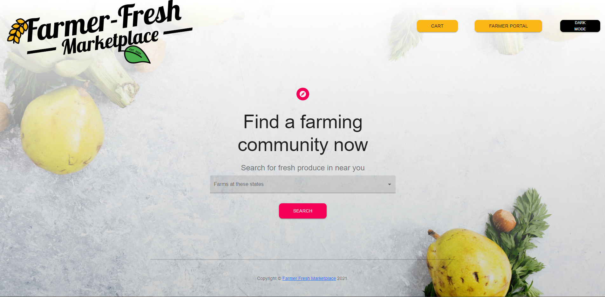
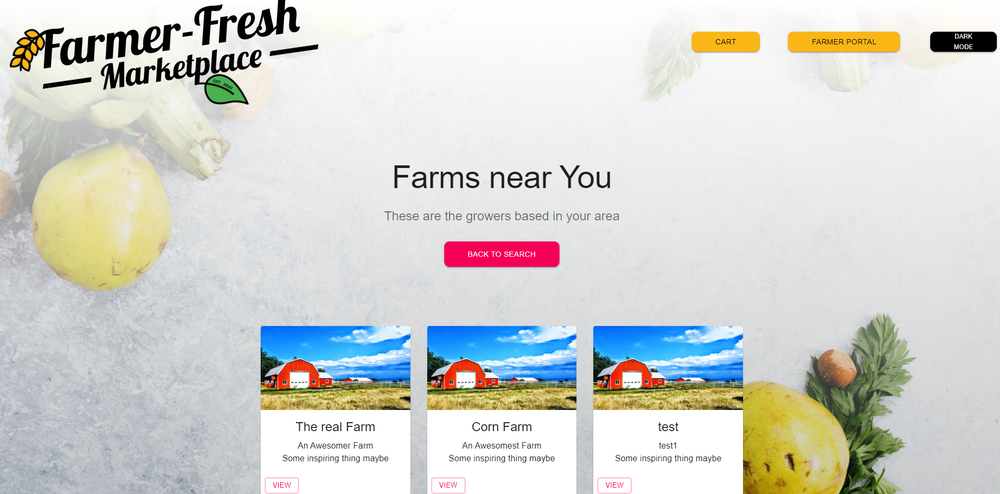
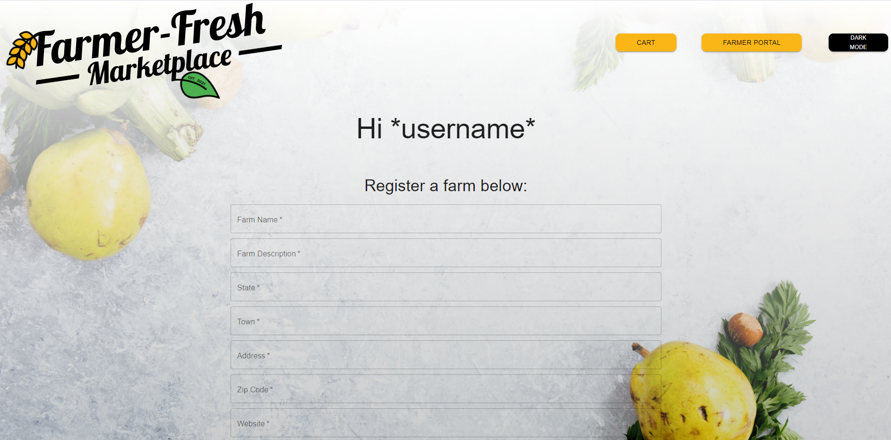

# FarmerFresh
Real veggies have flaws!

Farmer fresh is an MERN stack app for farmers to register their farms and sell their produce to the users directly from their farms.

# Installation

```bash
npm install
```
# Tools

HTML, CSS, Bootstrap, JavaScript, React, Node.js, Express.js, GraphQL, MongoDB and Mongoose, Robo 3T, Json Web Tokens (JWT), Dotenv, Heroku.

# Usage

1. Farmer goes on to Farmer Portal and register the farm to create a farm.

2. User can go on to the search page and find the farming community for the provided states in the drop down and click on the search button.

3. A list of farms displayed by selected state on the next page.

4. Once clicked on the selected farm the available produce of the farm will be displayed on the next page.

5. When the user clicks on Buy button, it prompts to the next page for the units or counts of the quantity required, the user clicks add to cart button and the list of items will be reviewed and the user can place the order.

## Screenshots






## Contact

Luke Teal - [GitHub](https://github.com/luketeal)
Kit Long - [GitHub] (https://github.com/kitclong)
Joshua Figuereo - [GitHub](https://github.com/Jfig27)
Swetha Reddivari - [GitHub](https://github.com/swethareddyl)

* [FarmerFresh] (https://github.com/luketeal/farmerFresh/)

* [Heroku Deployed Application] ()

## Credits

Credit to our full-stack web development course being offered as a collaboration between Trilogy Education Services and UNH Professional Development and Training.

